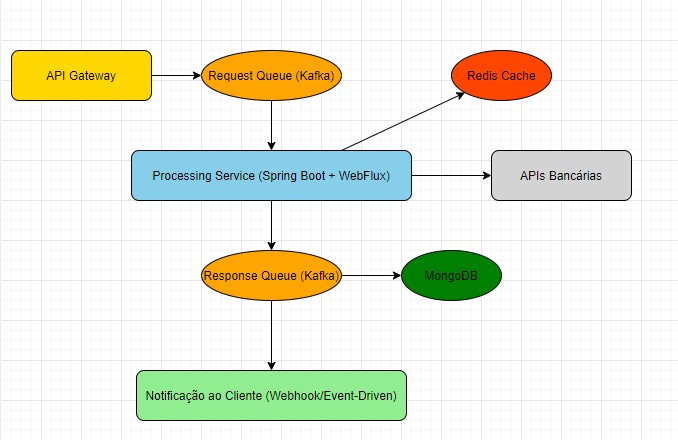

# Processing Service

**Processing Service** é uma aplicação desenvolvida em **Java 17** utilizando **Spring Boot**, que processa transações financeiras de forma assíncrona, garantindo escalabilidade, resiliência e integridade dos dados.

Este projeto faz parte de uma **prova de conceito (POC)** para demonstrar o uso de **Kafka, MongoDB, Redis e processamento assíncrono com WebFlux**.

## 📌 Desenho da Solução
A imagem abaixo ilustra a arquitetura da solução proposta para o **Processing Service**:



## 💧 Status do Projeto
🛠️ O projeto está em construção.

## 🎯 Objetivo do Projeto
O **Processing Service** tem como objetivo criar uma nova arquitetura para processamento de transações financeiras, trazendo melhorias em relação à solução existente. A nova abordagem busca resolver problemas de escalabilidade, resiliência e eficiência no tratamento de grandes volumes de dados, garantindo um sistema robusto e altamente performático.

A POC visa validar os seguintes aspectos:
- **Processamento Assíncrono via Kafka**: A solução deve consumir eventos de uma fila de requisições no Kafka e publicar os resultados processados em outra fila para consumo posterior.
- **Chamada a APIs Bancárias com Resiliência**: Simulação de APIs externas instáveis, garantindo um fluxo de retry automático com backoff exponencial.
- **Persistência de Dados em MongoDB**: Armazenamento das transações processadas de forma eficiente.
- **Otimização de Consultas com Redis**: Redução da carga no banco de dados ao cachear transações recentes.
- **Escalabilidade e Robustez**: Implementação de uma arquitetura distribuída capaz de suportar milhares de requisições simultâneas.
- **Notificação ao Cliente**: Uso de Webhooks/Event-Driven para avisar os clientes sobre o status do processamento.

## ☁️ Tecnologias Utilizadas

- **Java 17**
- **Spring Boot 3.2.1**
- **Spring WebFlux** (API reativa)
- **Spring Data MongoDB** (persistência)
- **Kafka** (mensageria)
- **Redis** (cache de dados)
- **Lombok** (redução de código boilerplate)
- **ModelMapper** (mapeamento de objetos)
- **JUnit 5 e Mockito** (testes automatizados)
- **Springdoc OpenAPI** (documentação da API com Swagger)
- **Docker e Docker Compose** (conteinerização e ambiente de desenvolvimento)

## 📋 Modelagem das Entidades

### TransactionProcess (Requisição de Transação)
- `id`: Identificador único (UUID)
- `userId`: ID do usuário que fez a transação
- `initialDate`: Data inicial da consulta
- `finalDate`: Data final da consulta

### Transaction (Transação Processada)
- `id`: Identificador único (UUID)
- `userId`: ID do usuário
- `categoryId`: ID da categoria classificada
- `categoryName`: Nome da categoria
- `amount`: Valor da transação
- `date`: Data e hora da transação
- `status`: Status do processamento (PENDENTE, PROCESSADO, ERRO)

## 📦 Arquitetura do Projeto
O projeto segue o padrão de **Arquitetura Hexagonal**, separando a lógica de negócios do mundo externo por meio de **Ports (interfaces)** e **Adapters (implementações)**.

**Principais Camadas:**
- **Domain:** Contém as regras de negócio.
- **Application:** Contém os casos de uso e as interfaces (ports).
- **Infrastructure:** Contém as implementações das interfaces e a configuração de infraestrutura.
- **REST:** Contém os controladores REST.

## 🛠️ Práticas e Padrões Utilizados
- **Arquitetura Hexagonal (Ports & Adapters)**
- **Clean Architecture**
- **Domain-Driven Design (DDD)**
- **Clean Code**
- **SOLID Principles**

## 📌 Versionamento da API
A API utiliza o seguinte caminho base configurado no `application.yml`:
```
/processing/api/v1
```
Isso indica que estamos na versão 1 da API. Futuras versões poderão ser adicionadas utilizando um novo caminho base, como `/api/v2`.

## 🚀 Como Executar o Projeto Localmente

### **Pré-requisitos:**
- **Java 17**
- **Maven**
- **Docker e Docker Compose**
- **MongoDB**
- **Kafka**
- **Redis**

### **Passos para rodar:**
1. Clone o repositório:
   ```bash
   git clone https://github.com/wcosme/processing-service.git
   ```
2. Acesse a pasta do projeto:
   ```bash
   cd processing-service
   ```
3. Compile o projeto:
   ```bash
   mvn clean package
   ```
4. Execute o Docker Compose:
   ```bash
   docker-compose up --build -d
   ```

---

### 🔗 **Endpoints Disponíveis**
| Método  | Endpoint                                    | Descrição |
|---------|--------------------------------------------|----------------------------------|
| POST    | `/processing/api/v1/transactions`         | Envio de uma requisição de análise de transação |
| GET     | `/processing/api/v1/transactions/{id}`    | Consulta do status de uma transação |
| GET     | `/processing/api/v1/transactions/user/{userId}` | Consulta das transações de um usuário |

---

## 🛠️ Melhorias Futuras
- Configurar monitoramento com **Prometheus** e **Grafana**
- Implementar suporte para notificações de status de processamento
- Criar um serviço externo para notificações via Webhook/Event-Driven

---

## 🛠️ Postman Environment
Dentro do projeto, existe uma pasta facilitar os testes de integração e automação das requisições:

1. **Pasta `postman`**: Contém os arquivos JSON da collections e do ambiente a serem importados no Postman.

### 🚀 Como Importar no Postman:
1. Abra o Postman.
2. Clique em **Importar**.
3. Selecione o arquivo `collection.json`.
4. Clique em **Engrenagem ⚙️** no canto superior direito do Postman.
5. Clique em **Importar** e selecione o arquivo `environment.json`.
6. Selecione o ambiente no canto superior direito do Postman e comece a executar as requisições!

---

## 📚 Documentação da API
A documentação da API está disponível através do Swagger UI, que pode ser acessado pela seguinte URL:
```
http://localhost:8080/processing/api/v1/swagger-ui/swagger-ui/index.html
```

## 🤝 Como Contribuir
Se desejar contribuir com o projeto, siga os passos abaixo:
1. Faça um fork do repositório.
2. Crie uma branch para sua feature: `git checkout -b minha-feature`.
3. Commit suas alterações: `git commit -m 'Adiciona minha feature'`.
4. Faça um push para a branch: `git push origin minha-feature`.
5. Abra um Pull Request.

---

## 💄 Licença
Este projeto está sob a licença MIT. Consulte o arquivo [LICENSE](LICENSE) para mais detalhes.

---

### 👤 **Autor**
**Wallace Gonçalves**
- [LinkedIn](https://www.linkedin.com/in/wcosme/)